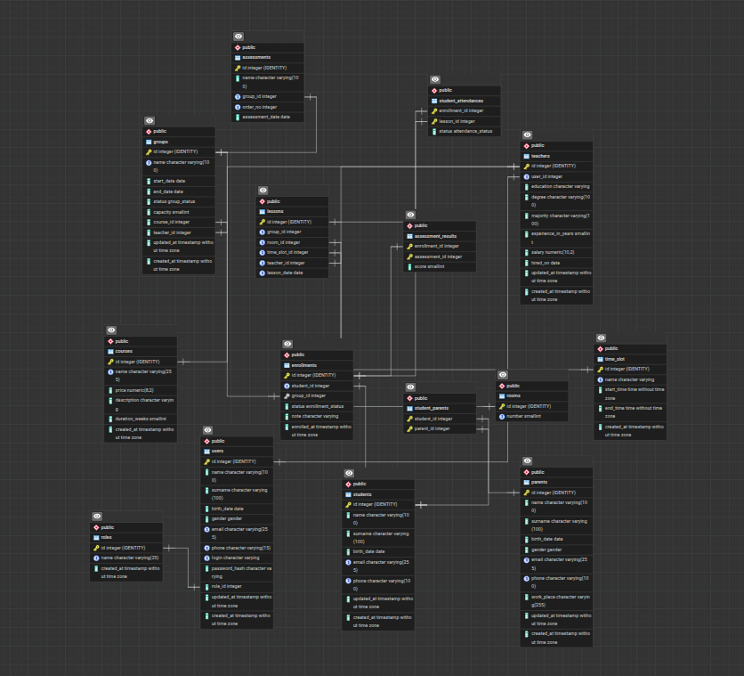

# Education Center Management System

A real business-based internal management system designed to automate the daily operations of an education center.  
The project is based on practical education center workflows.

The system is designed for internal staff members only. Students and parents do not directly interact with the system, but their information is managed by authorized users such as administrators, managers, and teachers.

## Main Features

- User and role management
- Teacher management
- Student management
- Parent information management
- Course management
- Group creation and management
- Student enrollment into groups
- Lesson scheduling
- Room and time slot management
- Attendance tracking
- Assessment management
- Assessment result recording
- Basic academic workflow automation

## Suggested Technology Stack

- Backend: ASP.NET Core Web API
- Database: PostgreSQL
- ORM: Entity Framework Core
- Authentication: JWT or Cookie Authentication
- API Documentation: Swagger / OpenAPI

## Project Status

The initial schema is prepared for building the first MVP version of the system.

## Future Improvements

Possible future improvements include:

- Certificate generation
- Advanced reporting
- Dashboard analytics
- Telegram or SMS notifications
- Audit logging
- Lesson auto-generation from weekly schedules
- Multi-branch support
- Payment management